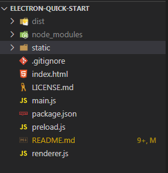
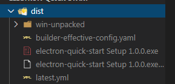
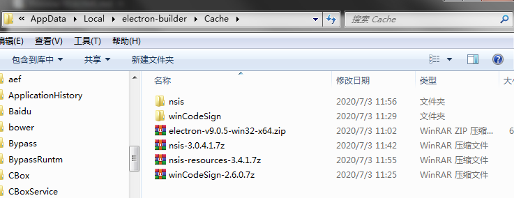
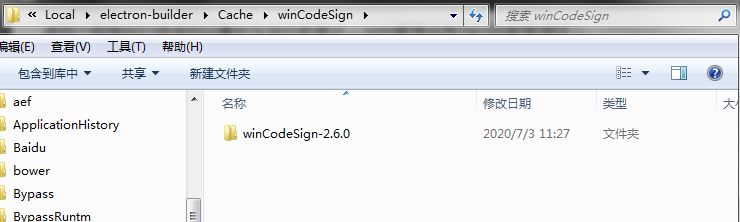
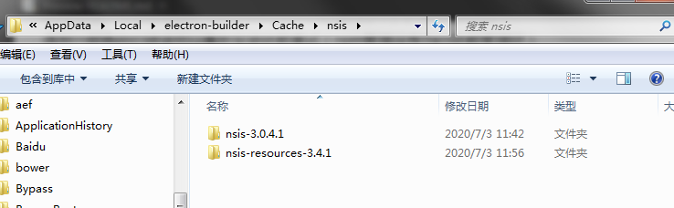

# Electron与串口交互示例

## 1.环境准备

### 1.1 安装Node、Npm

访问Node.js官网，选择Windows Installe，安装最新稳定版的Node.js 。
以下命令检验是否安装成功

```shell
# 下面这行的命令会打印出Node.js的版本信息
node -v

# 下面这行的命令会打印出npm的版本信息
npm -v
```

### 1.2 安装cnpm

由于国内的网络环境较差，所以要使用淘宝镜像源地址，安装cnpm

```shell
npm install -g cnpm --registry=https://registry.npm.taobao.org
# 验证是否安装成功
cnpm -v
cnpm@5.2.0 (C:\Users\Administrator\AppData\Roaming\npm\node_modules\cnpm\lib\parse_argv.js)
npm@5.8.0 (C:\Users\Administrator\AppData\Roaming\npm\node_modules\cnpm\node_modules\npm\lib\npm.js)
node@12.16.1 (D:\soft\node\node.exe)
npminstall@3.3.0 (C:\Users\Administrator\AppData\Roaming\npm\node_modules\cnpm\node_modules\npminstall\lib\index.js)
prefix=C:\Users\Administrator\AppData\Roaming\npm
win32 x64 6.1.7601
registry=https://registry.npm.taobao.org
```

### 1.3 安装Electron

用cnpm全局安装Electron

```shell
cnpm install -g electron
# 验证是否安装成功
electron -v
v9.0.5
```

我们采用官方提供的脚手架，快速配置项目

```shell
# 克隆这仓库
git clone https://github.com/electron/electron-quick-start
# 进入仓库
cd electron-quick-start
# 安装依赖库
cnpm install
# 运行应用
npm start
```

### 1.4 安装serialport

安装操作串口的依赖包

```shell
cnpm install serialport --save-dev
```

安装electron-rebuild(用来重新编译serialport包）

```shell
cnpm install --save-dev electron-rebuild
# 编译
.\node_modules\.bin\electron-rebuild.cmd
```

这个时候可能会编译失败，出现以下信息

```shell
× Rebuild Failed
An unhandled error occurred inside electron-rebuild
gyp info it worked if it ends with ok
gyp info using node-gyp@6.1.0
gyp info using node@12.16.1 | win32 | x64
gyp info find Python using Python version 3.6.5 found at "D:\soft\python\python.exe"
gyp http GET https://www.electronjs.org/headers/v9.0.5/node-v9.0.5-headers.tar.gz
gyp http 200 https://www.electronjs.org/headers/v9.0.5/node-v9.0.5-headers.tar.gz
gyp http GET https://www.electronjs.org/headers/v9.0.5/SHASUMS256.txt
gyp http GET https://www.electronjs.org/headers/v9.0.5/win-x64/node.lib
gyp http GET https://www.electronjs.org/headers/v9.0.5/win-arm64/node.lib
gyp http GET https://www.electronjs.org/headers/v9.0.5/win-x86/node.lib
gyp http 200 https://www.electronjs.org/headers/v9.0.5/win-x86/node.lib
gyp http 200 https://www.electronjs.org/headers/v9.0.5/win-arm64/node.lib
gyp http 200 https://www.electronjs.org/headers/v9.0.5/SHASUMS256.txt
gyp http 200 https://www.electronjs.org/headers/v9.0.5/win-x64/node.lib
gyp ERR! find VS
gyp ERR! find VS msvs_version not set from command line or npm config
gyp ERR! find VS VCINSTALLDIR not set, not running in VS Command Prompt
gyp ERR! find VS could not use PowerShell to find Visual Studio 2017 or newer
gyp ERR! find VS looking for Visual Studio 2015
gyp ERR! find VS - not found
gyp ERR! find VS not looking for VS2013 as it is only supported up to Node.js 8
gyp ERR! find VS
gyp ERR! find VS **************************************************************
gyp ERR! find VS You need to install the latest version of Visual Studio
gyp ERR! find VS including the "Desktop development with C++" workload.
gyp ERR! find VS For more information consult the documentation at:
gyp ERR! find VS https://github.com/nodejs/node-gyp#on-windows
gyp ERR! find VS **************************************************************
gyp ERR! find VS
gyp ERR! configure error
gyp ERR! stack Error: Could not find any Visual Studio installation to use
gyp ERR! stack     at VisualStudioFinder.fail (E:\code\electron-quick-start\node_modules\_node-gyp@6.1.0@node-gyp\lib\find-visualstudio.js:121:47)
gyp ERR! stack     at E:\code\electron-quick-start\node_modules\_node-gyp@6.1.0@node-gyp\lib\find-visualstudio.js:74:16
gyp ERR! stack     at VisualStudioFinder.findVisualStudio2013 (E:\code\electron-quick-start\node_modules\_node-gyp@6.1.0@node-gyp\lib\find-visualstudio.js:351:14)
gyp ERR! stack     at E:\code\electron-quick-start\node_modules\_node-gyp@6.1.0@node-gyp\lib\find-visualstudio.js:70:14
gyp ERR! stack     at E:\code\electron-quick-start\node_modules\_node-gyp@6.1.0@node-gyp\lib\find-visualstudio.js:372:16
gyp ERR! stack     at E:\code\electron-quick-start\node_modules\_node-gyp@6.1.0@node-gyp\lib\util.js:54:7
gyp ERR! stack     at E:\code\electron-quick-start\node_modules\_node-gyp@6.1.0@node-gyp\lib\util.js:33:16
gyp ERR! stack     at ChildProcess.exithandler (child_process.js:310:5)
gyp ERR! stack     at ChildProcess.emit (events.js:311:20)
gyp ERR! stack     at maybeClose (internal/child_process.js:1021:16)
gyp ERR! System Windows_NT 6.1.7601
gyp ERR! command "D:\\soft\\node\\node.exe" "E:\\code\\electron-quick-start\\node_modules\\_node-gyp@6.1.0@node-gyp\\bin\\node-gyp.js" "rebuild" "--target=9.0.5" "--arch=x64" "--dist-url=https://www.electronjs.org/headers" "--build-from-source"
gyp ERR! cwd E:\code\electron-quick-start\node_modules\_@serialport_bindings@9.0.0@@serialport\bindings
gyp ERR! node -v v12.16.1
gyp ERR! node-gyp -v v6.1.0
gyp ERR! not ok

Failed with exit code: 1

Error: gyp info it worked if it ends with ok
gyp info using node-gyp@6.1.0
gyp info using node@12.16.1 | win32 | x64
gyp info find Python using Python version 3.6.5 found at "D:\soft\python\python.exe"
gyp http GET https://www.electronjs.org/headers/v9.0.5/node-v9.0.5-headers.tar.gz
gyp http 200 https://www.electronjs.org/headers/v9.0.5/node-v9.0.5-headers.tar.gz
gyp http GET https://www.electronjs.org/headers/v9.0.5/SHASUMS256.txt
gyp http GET https://www.electronjs.org/headers/v9.0.5/win-x64/node.lib
gyp http GET https://www.electronjs.org/headers/v9.0.5/win-arm64/node.lib
gyp http GET https://www.electronjs.org/headers/v9.0.5/win-x86/node.lib
gyp http 200 https://www.electronjs.org/headers/v9.0.5/win-x86/node.lib
gyp http 200 https://www.electronjs.org/headers/v9.0.5/win-arm64/node.lib
gyp http 200 https://www.electronjs.org/headers/v9.0.5/SHASUMS256.txt
gyp http 200 https://www.electronjs.org/headers/v9.0.5/win-x64/node.lib
gyp ERR! find VS
gyp ERR! find VS msvs_version not set from command line or npm config
gyp ERR! find VS VCINSTALLDIR not set, not running in VS Command Prompt
gyp ERR! find VS could not use PowerShell to find Visual Studio 2017 or newer
gyp ERR! find VS looking for Visual Studio 2015
gyp ERR! find VS - not found
gyp ERR! find VS not looking for VS2013 as it is only supported up to Node.js 8
gyp ERR! find VS
gyp ERR! find VS **************************************************************
gyp ERR! find VS You need to install the latest version of Visual Studio
gyp ERR! find VS including the "Desktop development with C++" workload.
gyp ERR! find VS For more information consult the documentation at:
gyp ERR! find VS https://github.com/nodejs/node-gyp#on-windows
gyp ERR! find VS **************************************************************
gyp ERR! find VS
gyp ERR! configure error
gyp ERR! stack Error: Could not find any Visual Studio installation to use
gyp ERR! stack     at VisualStudioFinder.fail (E:\code\electron-quick-start\node_modules\_node-gyp@6.1.0@node-gyp\lib\find-visualstudio.js:121:47)
gyp ERR! stack     at E:\code\electron-quick-start\node_modules\_node-gyp@6.1.0@node-gyp\lib\find-visualstudio.js:74:16
gyp ERR! stack     at VisualStudioFinder.findVisualStudio2013 (E:\code\electron-quick-start\node_modules\_node-gyp@6.1.0@node-gyp\lib\find-visualstudio.js:351:14)
gyp ERR! stack     at E:\code\electron-quick-start\node_modules\_node-gyp@6.1.0@node-gyp\lib\find-visualstudio.js:70:14
gyp ERR! stack     at E:\code\electron-quick-start\node_modules\_node-gyp@6.1.0@node-gyp\lib\find-visualstudio.js:372:16
gyp ERR! stack     at E:\code\electron-quick-start\node_modules\_node-gyp@6.1.0@node-gyp\lib\util.js:54:7
gyp ERR! stack     at E:\code\electron-quick-start\node_modules\_node-gyp@6.1.0@node-gyp\lib\util.js:33:16
gyp ERR! stack     at ChildProcess.exithandler (child_process.js:310:5)
gyp ERR! stack     at ChildProcess.emit (events.js:311:20)
gyp ERR! stack     at maybeClose (internal/child_process.js:1021:16)
gyp ERR! System Windows_NT 6.1.7601
gyp ERR! command "D:\\soft\\node\\node.exe" "E:\\code\\electron-quick-start\\node_modules\\_node-gyp@6.1.0@node-gyp\\bin\\node-gyp.js" "rebuild" "--target=9.0.5" "--arch=x64" "--dist-url=https://www.electronjs.org/headers" "--build-from-source"
gyp ERR! cwd E:\code\electron-quick-start\node_modules\_@serialport_bindings@9.0.0@@serialport\bindings
gyp ERR! node -v v12.16.1
gyp ERR! node-gyp -v v6.1.0
gyp ERR! not ok

Failed with exit code: 1
    at SafeSubscriber._error (E:\code\electron-quick-start\node_modules\_spawn-rx@3.0.0@spawn-rx\lib\src\index.js:267:84)
    at SafeSubscriber.__tryOrUnsub (E:\code\electron-quick-start\node_modules\_rxjs@6.6.0@rxjs\internal\Subscriber.js:205:16)
    at SafeSubscriber.error (E:\code\electron-quick-start\node_modules\_rxjs@6.6.0@rxjs\internal\Subscriber.js:156:26)
    at Subscriber._error (E:\code\electron-quick-start\node_modules\_rxjs@6.6.0@rxjs\internal\Subscriber.js:92:26)
    at Subscriber.error (E:\code\electron-quick-start\node_modules\_rxjs@6.6.0@rxjs\internal\Subscriber.js:72:18)
    at MapSubscriber.Subscriber._error (E:\code\electron-quick-start\node_modules\_rxjs@6.6.0@rxjs\internal\Subscriber.js:92:26)
    at MapSubscriber.Subscriber.error (E:\code\electron-quick-start\node_modules\_rxjs@6.6.0@rxjs\internal\Subscriber.js:72:18)
    at SafeSubscriber._next (E:\code\electron-quick-start\node_modules\_spawn-rx@3.0.0@spawn-rx\lib\src\index.js:242:65)
    at SafeSubscriber.__tryOrUnsub (E:\code\electron-quick-start\node_modules\_rxjs@6.6.0@rxjs\internal\Subscriber.js:205:16)
    at SafeSubscriber.next (E:\code\electron-quick-start\node_modules\_rxjs@6.6.0@rxjs\internal\Subscriber.js:143:22)
```

通过错误信息不难看出，编译需要Python依赖以及Viscual C++的构建环境用来编译serialport模块

- 安装gyp命令 npm install -g node-gyp （如果有可以跳过）;
- 安装Visual C ++构建环境(C++ 生成工具
使用 Microsoft C++ 工具集、ATL 或 MFC 生成 Windows 桌面应用程序。)：[Visual Studio构建工具](https://visualstudio.microsoft.com/thank-you-downloading-visual-studio/?sku=BuildTools)
- 安装Python 2.7.3（v3.x.x不支持），安装后要配置环境变量。成功后执行npm config set python python2.7

在重新执行编译 提示“Rebuild Complete”表示执行成功

```shell
.\node_modules\.bin\electron-rebuild.cmd
√ Rebuild Complete
```

到此我们环境配置完成

## 2.开始开发

### 2.1 目录结构

- dist是打包的时候生成的
- static是自己加的目录，放图片信息
- main.js 是主进程的js
- render.js是渲染进程的js，index.html是渲染的html文件



### 2.2 获取串口的信息

```javascript
const SerialPort = require('serialport')

Serialport.list((err, ports) => {
    ports.forEach((port) => {
        console.log(port.comName);
    });
});
```

### 2.3 监听串口

```javascript
const port = new SerialPort('COM16');
  port.on('data',function(data){
    console.log('data:'+data)
  });
```

### 2.4 在渲染进程中使用serialport

将上述代码直接在reader.js里面添加，发现报如下所示的错误

```shell
renderer.js:7 Uncaught ReferenceError: require is not defined
    at renderer.js:7
```

需要在main.js里面定义，渲染进程就可以使用Node的模块，所以我们在主进程main.js里面如下，设置nodeIntegration为true

```javascript
 const mainWindow = new BrowserWindow({
    width: 800,
    height: 600,
    webPreferences: {
      preload: path.join(__dirname, 'preload.js'),
      nodeIntegration: true
    }
  })
```

重新启动后，发下控制台报一下错误

```shell
Uncaught Error: Loading non-context-aware native module in renderer: '\\?\E:\code\electron-quick-start\node_modules\_@serialport_bindings@9.0.0@@serialport\bindings\build\Release\bindings.node', but app.allowRendererProcessReuse is true. See https://github.com/electron/electron/issues/18397.
    at process.func [as dlopen] (electron/js2c/asar.js:140)
    at Object.Module._extensions..node (internal/modules/cjs/loader.js:1034)
    at Object.func [as .node] (electron/js2c/asar.js:140)
    at Module.load (internal/modules/cjs/loader.js:815)
    at Module._load (internal/modules/cjs/loader.js:727)
    at Function.Module._load (electron/js2c/asar.js:769)
    at Module.require (internal/modules/cjs/loader.js:852)
    at require (internal/modules/cjs/helpers.js:74)
    at bindings (E:\code\electron-quick-start\node_modules\_bindings@1.5.0@bindings\bindings.js:112)
    at Object.<anonymous> (E:\code\electron-quick-start\node_modules\_@serialport_bindings@9.0.0@@serialport\bindings\lib\win32.js:1)
```

可以参考上面报错信息中的[Issue](https://github.com/electron/electron/issues/18397) ， 在Electron9.0后就不允许在渲染进程中使用原生的模块。

解决方案一：在main.js中设置为false，就在渲染进程中使用原生模块,但是官方不推荐参考

```javascript
app.allowRendererProcessReuse = false;
```

参考[官方文档](https://www.electronjs.org/docs/api/ipc-main)找到最佳的解决方案

解决方案二：采用主进程与渲染进程之间通讯方式，主进程传递串口的数据到渲染进程

官方进程之间通讯的示例如下

```javascript
// 在主进程中.
const { ipcMain } = require('electron')
ipcMain.on('asynchronous-message', (event, arg) => {
  console.log(arg) // prints "ping"
  event.reply('asynchronous-reply', 'pong')
})

ipcMain.on('synchronous-message', (event, arg) => {
  console.log(arg) // prints "ping"
  event.returnValue = 'pong'
})
```

```javascript
//在渲染器进程 (网页) 中。
const { ipcRenderer } = require('electron')
console.log(ipcRenderer.sendSync('synchronous-message', 'ping')) // prints "pong"

ipcRenderer.on('asynchronous-reply', (event, arg) => {
  console.log(arg) // prints "pong"
})
ipcRenderer.send('asynchronous-message', 'ping')
```

---

那么我们基于这个主进程与渲染进程通讯的思路进行改造，最终改造main.js

```javascript
function createWindow () {
  // Create the browser window.
  const mainWindow = new BrowserWindow({
    width: 800,
    height: 600,
    webPreferences: {
      preload: path.join(__dirname, 'preload.js'),
      nodeIntegration: true
    }
  })

  // and load the index.html of the app.
  mainWindow.loadFile('index.html')

  // Open the DevTools.
  mainWindow.webContents.openDevTools()
  createSerialPort(mainWindow)
}

function createSerialPort(mainWindow){
  //开启串口，并发送到渲染线程中
  const port = new SerialPort('COM16');
  port.on('data',function(data){
    let strData = data+''
    //0 MW +00079.86 mm  
    let nValue = strData.replace('0 MW','').replace('mm','').trim()
    mainWindow.webContents.send("marh-data",parseFloat(nValue))
  });
}
```

render.js里面监听main.js的消息

```javascript
const { ipcRenderer } = require('electron')

ipcRenderer.on('marh-data', (event, arg) => {
    inputs = document.getElementsByClassName('marData')
    let isSet = false
    for(let i = 0 ; i < inputs.length ; i++){
        if ( inputs[i].value == '' || inputs[i].value == 0){
            isSet = true
            inputs[i].value = arg
            return
        }
    }
  })
```

## 3. 项目打包

[参考文章](https://segmentfault.com/a/1190000013924153)

electron-builder就是有比electron-packager有更丰富的的功能，支持更多的平台，同时也支持了自动更新，所以这里我选用electron-builder方式进行打包。

```shell
cnpm install electron-builder --save-dev
cnpm install electron-builder -g
```

在package.json中添加打包配置

```javascript
"build": {
    "appId": "com.vase.app",
    "mac": {
      "target": ["dmg"]
    },
    "win": {
      "target": ["nsis"]
    }
},
"scripts": {
    "build": "electron-builder --win --x64"
},
```

执行命令打包

```shell
npm run build
```

打包成功会出现以下信息



---

整个打包过程比较艰辛，受限于咱们天朝的网络环境，打包过程中依赖出现各式各样的花式报错，这里建议慢慢的看错误信息，寻找解决方案，我整整花了4个小时完成打包。
遇到一些诡异的错误可以重新安装依赖重试（npm管理没有Yarn依赖管理好）

```shell
# 删除依赖
rm -rf node_modules
rm package-lock.json
# 清空缓存
npm cache clear --force
# 重新安装
cnpm install
```

部门因为网络原因，无法下载工具已经放置在static/cache目录下
下载完成后按照下图所示将工具放置在一下目录中

[electron-v9.0.5-win32-x64.zip](https://download.csdn.net/download/qq_27224627/12573475)

[nsis-3.0.4.1.7z](https://download.csdn.net/download/qq_27224627/12573505)

[nsis-resources-3.4.1.7z](https://download.csdn.net/download/qq_27224627/12573505)

[winCodeSign-2.6.0.7z](https://download.csdn.net/download/qq_27224627/12573505)

C:\Users\Administrator\AppData\Local\electron-builder\Cache



C:\Users\Administrator\AppData\Local\electron-builder\Cache\winCodeSign


C:\Users\Administrator\AppData\Local\electron-builder\Cache\nsis

